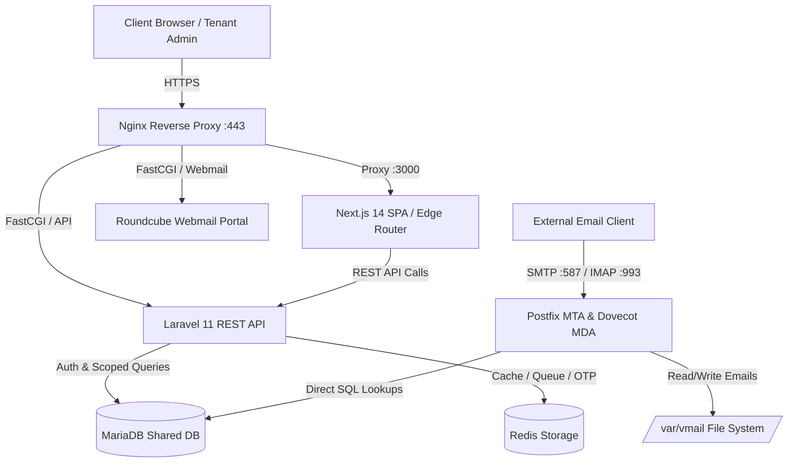

# EmailSaaS — Multi-Tenant Managed Business Email & SMTP SaaS Platform

A production-grade, headless multi-tenant business email hosting platform designed as a micro-alternative to Google Workspace and Microsoft 365. Built with Next.js 14, Laravel 11, Postfix, Dovecot, Roundcube, MariaDB, and Redis.

> **Architecture Documentation:** For the complete, low-level technical architecture, see [`docs/ARCHITECTURE.md`](docs/ARCHITECTURE.md).

---

## Overview

`EmailSaaS` provides small-to-medium businesses (SMBs) with isolated tenant workspaces, custom domain binding, business email inbox creation, SMTP/IMAP access, seamless Webmail Single Sign-On (SSO) via Roundcube, and prepaid subscription billing powered by SSLCommerz.



---

## Key Features

*   **Wildcard Subdomain Multi-Tenancy:** Dynamic tenant isolation at the edge (`{tenant}.mailsaas.com`) utilizing Next.js Edge Middleware and Laravel container-bound tenant resolution.
*   **Custom Domain Management:** Connect custom domains (`example.com`) with real-time DNS verification (MX, SPF, DKIM, DMARC checks).
*   **Business Mailbox Provisioning:** Instant inbox creation (`info@example.com`) with quota enforcement and Dovecot-compatible `SHA512-CRYPT` password hashing.
*   **Webmail Single Sign-On (SSO):** Seamless, one-click login from the tenant dashboard directly into Roundcube Webmail using short-lived 60-second OTP tokens in Redis.
*   **Prepaid Billing & SSLCommerz Integration:** Multi-tier subscription plans (Monthly/Yearly) with automated SSLCommerz IPN hash and amount verification.
*   **Automated Expiration Handling:** Scheduled background task (`tenant:suspend-expired`) that auto-suspends overdue tenants and blocks Postfix/Dovecot mail routing in real-time.
*   **Decoupled & Localized:** Next.js 14 SPA frontend localized with `next-intl` (strict English) and a headless Laravel 11 API protected by Sanctum stateful authentication.

---

## Technology Stack

| Layer | Component | Implemented Technology & Version |
| :--- | :--- | :--- |
| **Frontend** | Framework | Next.js `14.1.0` (App Router, Standalone Output) |
| | UI & Styling | React `18.2.0`, Tailwind CSS `3.4.1`, Shadcn UI, Lucide Icons |
| | Data & State | SWR `2.2.5`, Axios `1.6.7`, React Hook Form, Zod `3.22.4` |
| | Localization | `next-intl` `3.9.0` (Strict English) |
| **Backend** | API Engine | Laravel `11.0` (PHP `^8.2`) |
| | Authentication | Laravel Sanctum `4.0` (Stateful SPA Cookies) |
| | Authorization | Spatie Laravel Permission `^6.7`, Eloquent Policies |
| | Payment Gateway| `BillingService` (SSLCommerz Integration) |
| **Mail Stack** | MTA | Postfix with `postfix-mysql` |
| | MDA / IMAP / POP3| Dovecot with `dovecot-mysql` |
| | Webmail | Roundcube Webmail (Elastic Skin) |
| **Data & Cache** | Relational DB | MariaDB / MySQL 8.0 |
| | In-Memory Store | Redis (Cache, Queues, SSO OTPs) |
| **DevOps & OS** | OS / Web Server | Ubuntu Linux (22.04 LTS / 24.04 LTS), Nginx |
| | Process Control | Supervisor (`mailsaas-worker`), PM2 (Next.js Node server) |

---

## Multi-Tenancy

The platform provides workspace isolation for tenants using wildcard subdomains:

```
mailsaas.com (Root Platform)
    ├── vyzobd.mailsaas.com   (Tenant Workspace A)
    ├── acme.mailsaas.com     (Tenant Workspace B)
    └── techcorp.mailsaas.com (Tenant Workspace C)
```

1.  **Edge Subdomain Rewriting:** Next.js Edge Middleware (`frontend/src/middleware.ts`) parses the incoming host header and rewrites requests matching `{tenant}.mailsaas.com` to `/(tenant)/[subdomain]/...`.
2.  **API Tenant Resolution:** Laravel's `IdentifyTenant` middleware inspects the `Origin`/`Host` request header, locates the tenant in the `domains` table, and binds the tenant model instances (`app('tenant.user')`) to the service container.
3.  **Data Isolation:** Eloquent policies (`DomainPolicy`) enforce strict user-level ownership, preventing Direct Object Reference (IDOR) access across tenants.

---

## Mail Infrastructure

The system integrates a Linux mail server stack with the shared MariaDB database:

```
Internet Mail ──> Postfix MTA ──> MariaDB SQL Lookup ──> Dovecot MDA ──> /var/vmail
```

*   **Postfix (MTA):** Configured via `/etc/postfix/mysql-virtual-mailbox-domains.cf` and `/etc/postfix/mysql-virtual-mailbox-maps.cf` to query domain validity and mailbox paths directly from MariaDB.
*   **Dovecot (IMAP/MDA):** Configured via `/etc/dovecot/dovecot-sql.conf.ext` using `default_pass_scheme = SHA512-CRYPT` to verify credentials directly against MariaDB.
*   **Storage Directory:** Mailboxes are stored locally in `/var/vmail/{domain}/{local_part}/` owned by the `vmail` system user (UID/GID `5000`).

---

## Billing & Subscription

Subscriptions operate on a prepaid billing cycle:
1.  **Plan Selection:** Tenants select a Monthly or Yearly subscription tier (Starter, Business, Enterprise).
2.  **Payment Initiation:** Hitting `/api/billing/checkout` creates a pending invoice and returns the SSLCommerz gateway URL.
3.  **Asynchronous IPN Webhook:** SSLCommerz POSTs to `/api/billing/ipn`. The system verifies the MD5 signature and validates that `$paidAmount == $invoiceTotal` before marking the invoice as `paid` and extending `user.plan_expires_at`.
4.  **Automated Suspension:** When a subscription expires, the background scheduler updates the tenant and domain status to `suspended`, causing Postfix and Dovecot queries to immediately reject mail operations.

---

## Repository Structure

```
email-saas/
├── docs/                               # System Architecture Documentation
│   └── ARCHITECTURE.md                 # Complete Low-Level Technical Architecture
├── dovecot-config/                     # Dovecot IMAP/MDA Configuration Templates
├── frontend/                           # Next.js 14 Single Page Application
│   ├── messages/en.json                # i18n Localization Dictionary
│   ├── src/app/(admin)/                # Platform Owner Administration Panel
│   ├── src/app/(auth)/                 # Authentication Pages (Login, Register)
│   ├── src/app/(tenant)/[subdomain]/   # Dynamic Tenant Workspace Routing
│   ├── src/lib/api.ts                  # Axios API Client with CSRF Support
│   └── src/middleware.ts               # Next.js Edge Subdomain Rewrite Router
├── laravel-panel/                      # Laravel 11 Headless API Backend
│   ├── app/Console/Commands/           # Scheduled Tasks (SuspendExpiredTenants)
│   ├── app/Http/Controllers/Api/       # REST API Controllers (Auth, Domain, Mailbox, Billing, SSO)
│   ├── app/Http/Middleware/            # Tenant Identification & Active Subscription Middlewares
│   ├── app/Services/                   # BillingService, PostfixService, DnsVerificationService
│   ├── database/migrations/            # Schema Migrations (users, domains, mailboxes, plans, invoices)
│   └── routes/api.php                  # REST API Endpoints
├── nginx-config/                       # Nginx Reverse Proxy & SSL Configuration
├── postfix-config/                     # Postfix SMTP MTA Configuration Templates
├── roundcube-config/                   # Roundcube Webmail Client Configuration
├── scripts/                            # Linux Automation Bash Scripts (add_domain, add_mailbox)
└── server-configs/                     # Directly Applied Production Configuration Snippets
```

---

## Environment Configuration

### Backend Environment (`laravel-panel/.env`)
```env
APP_NAME=EmailSaaS
APP_ENV=production
APP_KEY=
APP_URL=https://panel.mailsaas.com
BASE_DOMAIN=mailsaas.com

DB_CONNECTION=mysql
DB_HOST=127.0.0.1
DB_PORT=3306
DB_DATABASE=email_saas_db
DB_USERNAME=laravel_db_user
DB_PASSWORD=

REDIS_HOST=127.0.0.1
REDIS_PORT=6379

QUEUE_CONNECTION=redis
CACHE_STORE=redis

SSLCOMMERZ_STORE_ID=
SSLCOMMERZ_STORE_PASS=
SSLCOMMERZ_SANDBOX=true
```

### Frontend Environment (`frontend/.env.local`)
```env
NEXT_PUBLIC_API_URL=https://panel.mailsaas.com/api
NEXT_PUBLIC_APP_NAME=EmailSaaS
NEXT_PUBLIC_WEBMAIL_URL=https://webmail.mailsaas.com
```

---

## Installation & Setup

### Prerequisites
*   Node.js `^20.0.0`
*   PHP `^8.2` with `pdo_mysql`, `mbstring`, `xml`, `curl`, `zip`
*   Composer `^2.0`
*   MariaDB / MySQL 8.0
*   Redis Server

### 1. Backend Setup (Laravel)
```bash
cd laravel-panel

# Install dependencies
composer install

# Environment setup
cp .env.example .env
php artisan key:generate

# Database migration & seeding
php artisan migrate --seed

# Create storage symlink
php artisan storage:link
```

### 2. Frontend Setup (Next.js)
```bash
cd ../frontend

# Install dependencies
npm install

# Environment setup
cp .env.local.example .env.local

# Run development server
npm run dev
```

---

## Running Development Services

To run the complete platform locally during development, run the following processes:

```bash
# Process 1: Next.js Frontend (Port 3000)
cd frontend && npm run dev

# Process 2: Laravel API Backend (Port 8000)
cd laravel-panel && php artisan serve

# Process 3: Queue Worker
cd laravel-panel && php artisan queue:work

# Process 4: Scheduler Worker
cd laravel-panel && php artisan schedule:work
```

---

## Queue & Scheduler

```
Laravel API ──> Redis Queue ──> Supervisor Worker (php artisan queue:work)
Cron (* * * * *) ──> php artisan schedule:run ──> tenant:suspend-expired
```

*   **Queue Processing:** Heavy background tasks (emails, webhooks) are dispatched to Redis and executed by background queue workers managed by Supervisor (`server-configs/mailsaas-worker.conf`).
*   **Scheduler:** System cron executes `php artisan schedule:run` every minute, triggering `tenant:suspend-expired` to suspend overdue subscriptions.

---

## Production Deployment Overview

1.  **Nginx Reverse Proxy:** Use `nginx-config/emailsaas.conf` for SSL termination (Let's Encrypt Wildcard Certificate `-d mailsaas.com -d *.mailsaas.com`), static asset caching, and FastCGI proxying.
2.  **Next.js PM2 Process:** Deploy Next.js using standalone build output:
    ```bash
    cd frontend && npm run build
    pm2 start npm --name "emailsaas-frontend" -- start
    ```
3.  **Supervisor Workers:** Copy `server-configs/mailsaas-worker.conf` to `/etc/supervisor/conf.d/` and reload Supervisor.
4.  **Mail Server Binding:** Execute `server-configs/setup-permissions.sh` to initialize `/var/vmail` and apply the Postfix/Dovecot SQL mapping configurations from `server-configs/`.

---

## Security Architecture

*   **Stateful Sanctum Authentication:** Uses CSRF-protected HTTP-only cookies (`/sanctum/csrf-cookie`).
*   **Mail Password Hashing:** Uses salted `SHA512-CRYPT` hashes (`crypt($password, '$6$' . $salt . '$')`) for Dovecot compatibility.
*   **Short-Lived Webmail SSO:** Single-use 32-character OTP tokens stored in Redis with a 60-second TTL.
*   **Strict Webhook Verification:** SSLCommerz IPN handler verifies MD5 signatures and checks exact paid amount matches (`$paidAmount == $invoiceTotal`).

---

## Documentation Index

| Document | File Path | Description |
| :--- | :--- | :--- |
| **AI Handoff** | [`docs/AI-HANDOFF.md`](docs/AI-HANDOFF.md) | **Mandatory starting point for AI Coding Agents.** |
| **Implementation Status** | [`docs/IMPLEMENTATION-STATUS.md`](docs/IMPLEMENTATION-STATUS.md) | Current implementation checklist. |
| **System Architecture** | [`docs/ARCHITECTURE.md`](docs/ARCHITECTURE.md) | Locked technical architecture and data flow. |
| **Implementation Overview** | [`docs/IMPLEMENTATION.md`](docs/IMPLEMENTATION.md) | High-level summary of what is implemented. |
| **Modules Reference** | [`docs/MODULES.md`](docs/MODULES.md) | Technical module breakdown. |
| **API Contract** | [`docs/API-CONTRACT.md`](docs/API-CONTRACT.md) | REST API endpoints and authorization rules. |
| **Database Schema** | [`docs/DATABASE.md`](docs/DATABASE.md) | MariaDB schema and Mail Server coupling rules. |
| **Infrastructure** | [`docs/INFRASTRUCTURE.md`](docs/INFRASTRUCTURE.md) | Deployment, Paths, and File permissions. |
| **Security Boundaries** | [`docs/SECURITY.md`](docs/SECURITY.md) | Multi-tenancy, Privilege Escalation, Password Security. |
| **Technical Decisions** | [`docs/DECISIONS.md`](docs/DECISIONS.md) | TDRs (Technical Decision Records). |
| **Changelog** | [`docs/CHANGELOG.md`](docs/CHANGELOG.md) | Implementation history. |

---

## Contributing

1.  Maintain strict tenant isolation and policy checks on all new endpoints.
2.  Do not include hardcoded user-facing English strings in the frontend; update `frontend/messages/en.json`.
3.  Ensure mailbox password modifications preserve the `SHA512-CRYPT` hashing format.
4.  Before implementing changes, consult `docs/AI-HANDOFF.md` and strictly follow the Master Implementation Documentation System. You MUST update `IMPLEMENTATION.md`, `IMPLEMENTATION-STATUS.md`, and `CHANGELOG.md` upon completion.

---

## License

This project is proprietary software released under the [MIT License](LICENSE).
